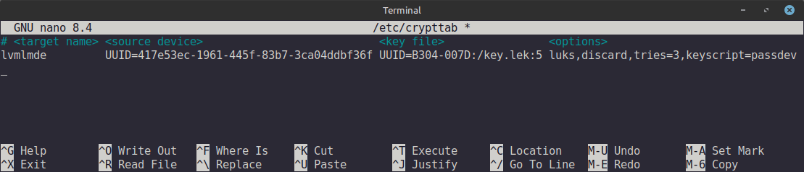
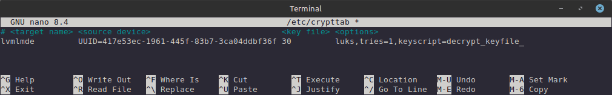
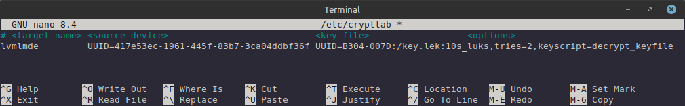

[](COPYING)

# decrypt_keyfile

Getting a key from a file for an encrypted volume.

## TL;DR

Assume the following:

- Your encrypted volume is `/dev/sda2`;
- The encrypted volume is mounted under the name `lvmlmde` in `/dev/mapper/lvmlmde`;
- Your USB flash drive for storing the key `key.lek` is `/dev/sdc1`;

1. Clone the script:

   ```bash
   git clone git@github.com:mgmsam/decrypt_keyfile.git
   ```

2. Add the script to the system:

   ```bash
   sudo cp ./decrypt_keyfile/decrypt_keyfile /usr/lib/cryptsetup/scripts/
   ```

3. Make the script executable:

   ```bash
   sudo chmod 755 /usr/lib/cryptsetup/scripts/decrypt_keyfile
   ```

4. Mount the USB flash drive:

   ```bash
   mount /dev/sdc1 /mnt
   ```

5. Create a 512-byte key file with random data:

   ```bash
   dd if=/dev/urandom of="/mnt/key.lek" bs=1 count=512 status=progress
   ```

6. Add key to crypted device:

   ```bash
   cryptsetup --verbose luksAddKey "/dev/sda2" "/mnt/key.lek"
   ```

7. Get UUID of USB flash drive:

   ```bash
   USB_UUID="$(blkid --match-tag UUID --output value "/dev/sdc1")"
   ```

8. Get UUID of crypted device:

   ```bash
   LUKS_UUID="$(cryptsetup luksUUID "/dev/sda2")"
   ```

9. Save configuration for encrypted devices:

   ```bash
   cat <<CRYPTTAB > /etc/crypttab
   # <target name> <source device>                           <key file>              <options>
   lvmlmde         UUID=$LUKS_UUID UUID=$USB_UUID:/key.lek luks,keyscript=decrypt_keyfile
   CRYPTTAB
   ```

10. Updating initramfs and restart:

    ```bash
    update-initramfs -u
    ```
---

## Why this script was created

The `cryptsetup` package provides the program `/usr/lib/cryptsetup/scripts/passdev`, which unlocks an encrypted volume using the key specified in the third field of the `/etc/crypttab` file and has a timeout for key waiting, after which a password will be requested.



However, in my distribution [LMDE 7](https://linuxmint.com/download_lmde.php), based on [Debian 13](https://www.debian.org), I encountered two problems:

1. The timeout doesn't work. If I don't insert the USB stick with the key, the password is not requested;
2. The value specified in the `tries` option does not correspond to the actual number of attempts allowed for an incorrect password;

The reasons for the first problem are not obvious to me, as `/usr/lib/cryptsetup/scripts/passdev` is a binary file.

The reason for the second problem lies in the structure of the `initramfs` scripts:

1. The script `/usr/share/initramfs-tools/init` calls three functions starting from line 289:

   ```shell
   mount_top
   mount_premount
   mountroot
   ```

2. Each of these functions is obtained from the file `/usr/share/initramfs-tools/scripts/local`, and their task is to run the scripts located in the `local-*` directories:
   
   ```shell
   tree /usr/share/initramfs-tools/scripts/local-*
   ```

   output:

   ```bash
   local-block
   ├── cryptroot
   └── mdadm
   local-bottom
   ├── cryptgnupg-sc
   ├── cryptopensc
   ├── cryptroot
   ├── mdadm
   └── ntfs_3g
   local-premount
   ├── btrfs
   ├── fixrtc
   ├── ntfs_3g
   └── resume
   local-top
   ├── cryptopensc
   ├── cryptroot
   └── dmraid
   ```

As you can see, the `init` script runs the `cryptroot` script 3 times in my distribution. This is necessary because you might have a software RAID that needs to be assembled first and then decrypted, or in other scenarios, disks must be decrypted before the array is assembled.

At each of these three steps, `cryptroot` searches for encrypted volumes and attempts to decrypt them. It is `cryptroot` that executes `cryptsetup` to decrypt the volumes using the key, requests the password, and monitors the number of attempts.

Consequently, if I specify the option `tries=3`, I end up with 9 attempts instead of 3. Upon reaching the maximum number of incorrect password attempts, you are dropped into the `initramfs` console for manual mounting of the root partition, which makes no sense to me.


## Description

When the `initramfs` image is updated, the system script `/usr/share/initramfs-tools/scripts/local-top/cryptroot` is placed within it at the path `/script/local-top/cryptroot` (hereinafter referred to as `cryptroot`), along with the configuration file for encrypted volumes `/etc/crypttab`.

If the `keyscript=...` option is present in the fourth field (`<options>`) of the `/etc/crypttab` file, the corresponding script is placed in the `initramfs` image using the full specified path. If the path is unspecified, as in our case, the script is placed in `/usr/lib/cryptsetup/scripts/`.

When the OS boots from the `initramfs` image unpacked in memory, the `cryptroot` script reads the `/etc/crypttab` configuration file line by line. For each encrypted volume found, it analyzes its fourth options field (`<options>`).

If it finds the `keyscript=...` option, it runs the corresponding script. Before running the script, which in our case is `decrypt_keyfile`:

*   The third field of the `/etc/crypttab` file is passed to it as a single argument;
*   If there are additional options in the fourth field, such as `tries=...`, `keyfile_size=...`, `keyfile_offset=...` and many others depending on your `cryptroot` version, the `cryptroot` script exports these options as variables with the `CRYPTTAB_OPTION_...` prefix (e.g., `CRYPTTAB_OPTION_tries`, `CRYPTTAB_OPTION_keyfile_size`, ...), so that these options are available to the executed script;

`decrypt_keyfile` supports the following options from the fourth field of `/etc/crypttab`:
  - `tries=` - Specifies the maximum number of times the user is queried for a password. The default is 3. If set to 0, the user is queried for a password indefinitely.
  - `keyfile-size=` - Specifies the maximum number of bytes to read from the key file. See [cryptsetup(8)](https://linux.die.net/man/8/cryptsetup) for possible values and the default value of this option. This option is ignored in plain encryption mode, where the key file size is determined by the key size. It is also ignored when the key file is used as a salt file for a FIDO2 token, as the salt size in that case is defined by the FIDO2 specification to be exactly 32 bytes.
  - `keyfile-offset` - Specifies the number of bytes to skip at the start of the key file. See [cryptsetup(8)](https://linux.die.net/man/8/cryptsetup) for possible values and the default value of this option.

In the third field of the `/etc/crypttab` file, you can specify three subfields separated by a `:` character:

  1. `DEV`- The path to the block device in the form: `UUID=...`, `LABEL=...`, `PARTUUID=...`, `PARTLABEL=...`, and `/dev/disk/by-uuid/...`;

  2. `KEY` - The path to the key file. If `DEV` is specified, the key is searched for relative to the root of `DEV`;

  3. `TIMEOUT` - The timeout for waiting for the key/password to unlock the encrypted volume.
      - Supported units of measurement are `s` (seconds), `m` (minutes), `h` (hours), and `d` (days).
      - If the timeout is not specified, the timeout for waiting for the key is 5 seconds. If the key is not found, a password will be requested, and the password waiting time is unlimited.
      - If the timeout is set, it applies to waiting for the key. If the key is not found, the same timeout is applied to waiting for the password. Upon reaching the timeout, the system will shut down.

        > _**WARNING**: If you have set the path to a key, you must verify the unlocking of the encrypted volume using the key without a timeout. If an incorrect key is found, you will not receive a password prompt._

## Examples

Each of the sub-fields can be empty or have the values: `-` and `none`. A `TIMEOUT` field with a value of `-`, `none`, `0`, or `infinity` will set an unlimited key/password waiting time.

You don't necessarily have to specify all fields; only the necessary ones are sufficient.

- ### Set password timeout:

  ```
  # <target name> <source device>                           <key file> <options>
  lvmlmde         UUID=417e53ec-1961-445f-83b7-3ca04ddbf36f 30         luks,tries=1,keyscript=decrypt_keyfile
  ```

  If the password is not entered within 30 seconds, or if the password is incorrect, the system will shut down.

  

  


  ```
  # <target name> <source device>                           <key file> <options>
  lvmlmde         UUID=417e53ec-1961-445f-83b7-3ca04ddbf36f none       luks,tries=2,keyscript=decrypt_keyfile
  ```

  The time for entering the password is unlimited, but if you enter the wrong password 2 times, the system will shut down.

  

  

- ### Set path to key on a block device:

  ```
  # <target name> <source device>                           <key file>                  <options>
  lvmlmde         UUID=417e53ec-1961-445f-83b7-3ca04ddbf36f UUID=B304-007D:/key.lek:10s luks,tries=2,keyscript=decrypt_keyfile
  ```

  If the key is not found within 10 seconds, the password will be requested. If the password is not entered within 10 seconds or is entered incorrectly 2 times in a row, the system will shut down.

  

  

- ### Set path to the key which is a block device:

  ```
  # <target name> <source device>                           <key file>                     <options>
  lvmlmde         UUID=417e53ec-1961-445f-83b7-3ca04ddbf36f /dev/disk/by-uuid/B304-007D:5s luks,keyscript=decrypt_keyfile
  ```

  or

  ```
  # <target name> <source device>                           <key file>            <options>
  lvmlmde         UUID=417e53ec-1961-445f-83b7-3ca04ddbf36f UUID=B304-007D:none:5 luks,keyscript=decrypt_keyfile
  ```

  These two examples are identical, and the key is the entire block device.

  If you specified the size and position of the key when adding the key to the encrypted volume slot, remember to add the corresponding options `keyfile-size=...` and `keyfile-offset=...` in the fourth field.

- ### Set path to the key file on the file system:

  ```
  # <target name> <source device>                           <key file>      <options>
  lvmlmde         UUID=417e53ec-1961-445f-83b7-3ca04ddbf36f /run/key.lek:3s luks,keyscript=decrypt_keyfile
  ```

  or

  ```
  # <target name> <source device>                           <key file>      <options>
  lvmlmde         UUID=417e53ec-1961-445f-83b7-3ca04ddbf36f :/run/key.lek:3 luks,keyscript=decrypt_keyfile
  ```

  or

  ```
  # <target name> <source device>                           <key file>        <options>
  lvmlmde         UUID=417e53ec-1961-445f-83b7-3ca04ddbf36f -:/run/key.lek:3s luks,keyscript=decrypt_keyfile
  ```

  These three examples are identical, and the key is a file. As in the previous examples, options `keyfile-size=...`, `keyfile-offset=...`, and `tries=` are also supported here.
